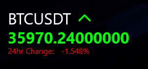

# Rainmeter-MinimalCryptoTracker

This is a rainmeter skin currently under development. It displays the current price and 24hr change of a specified cryptocurrency using the binance public api. 

**Currently Under Very Early Development! Expect Issues!**

---
## **Variables**    
|Variables         |Default Value     |Description                                                        |
|:-----------------|:-----------------|:------------------------------------------------------------------|
|TradeSymbol       |BTCUSDT           |The symbols of the desired trade pair.                             |
|ScaleValue        |1                 |The value to scale the size of the skin.                           |
|TextFace          |Product Sans      |The font used.                                                     |
|TextCol           |255,255,255       |The main text colour used.                                         |
|TextSize          |24                |The main font size used.                                           |
|TextSpacing       |15                |The space between text.                                            |
|UpCol             |0,255,0           |The colour used to indicate the cryptocurrency is up.              |
|DownCol           |255,0,0           |The colour used to indicate the cryptocurrency is down.            |
|PriceCol          |#TextCol#         |The colour used by the price indicator. Changes based on the price.|
|ArrowEnabled      |0                 |0 to show the arrow / 1 to hide the arrow.                         |
|ArrowSpacing      |15                |The space between the arrow and trade symbol label.                |
|PercentageEnabled |0                 |0 to show the percentage / 1 to hide the percentage.               |
|PercentageTextSize|(#TextSize# * 0.5)|The size of the percentage text, by default half of the text size. |
|PercentageCol     |#TextCol#         |The colour used by the percentage. Changes based on the percentage.|
---
## **Variants:**
- Single Tracker:

    

